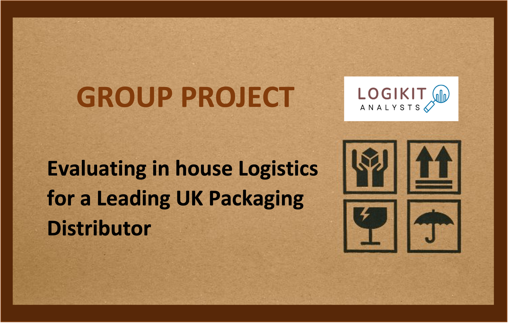

# Group Project : Evaluating the Feasibility of In-House Delivery for a Leading UK Packaging Company 
  
>🔦 *Disclaimer: I completed the following project as part of the LSE Data Analytics Career Accelearator Course (April 2024 - November 2024)*

>🔖 Grade 85%

  

## ❓ Can a leading UK packaging distribution company reduce costs and improve efficiency by bringing deliveries in-house?

### 📌 Overview

This was a real-world group project, where three other LSE data analysts and I, as part of ‘Logikit Analysts’, worked with a UK packaging Distribution Company to evaluate whether transitioning from third-party couriers to in-house deliveries would be financially viable.

Our team had complementary skills, so we divided responsibilities effectively. My focus was on ensuring data quality, structuring the analysis, and applying Python and Excel for key calculations. I also contributed to the creative side of the project, designing our team logo and report visuals to help communicate our findings effectively.

Since this was a real-world business project, the data, report, and presentation are confidential, so I can only share the approach and key insights.

### 🛠️ Approach & Tools

*1. Data Preparation & Collaboration*

- Ensured data quality and structured analysis using Python (Pandas, NumPy), Excel, and Tableau.
- Standardised partial postcodes and used Google Distance Matrix API to calculate distances from the Coventry Distribution Centre.
- Conducted biweekly meetings and collaborated via Google Docs and WhatsApp to maintain workflow efficiency.

*2. Key Analytical Areas*

- Profit Impact - Evaluated whether in-house deliveries would lead to cost savings.
- Fleet Optimisation - Determined the optimal fleet size and vehicle types needed to sustain in-house deliveries.
- Freight & Route Efficiency - Used Google API, Python, and Tableau to analyse delivery distances, customer demand clusters, and cost per mile.

### 📊 Business Impact

- Identified the most profitable delivery routes within a 50-mile radius, leading to potential monthly cost savings of £6.5k for the company.
- Determined that transitioning in-house deliveries to key regions (Greater Birmingham, Leicestershire, and South Midlands) could reduce delivery costs as a percentage of revenue by 19%.
- Recommended a fleet of four 7.5-ton LGVs with four drivers, ensuring operational efficiency while maintaining an 8-hour shift schedule.
- Tested delivery feasibility at different distance ranges (25 and 100 miles), confirming that deliveries beyond 50 miles would not be cost-effective.
- Used Python, Tableau, and Google API for route optimisation, clustering, and distance analysis, validating the model with external route optimisation software (Routific).
- Proposed a hybrid model with courier partnerships as a contingency, mitigating operational risks while maximising cost efficiency.

### 🎯 Key Takeaways

- Gained hands-on experience in logistics and supply chain analytics, applying data science techniques to optimise fleet operations.
- Strengthened my ability to collaborate in a real-world business environment, working as part of a team to structure, validate, and present actionable insights.
- Developed expertise in route optimisation, comparing results between Python-based algorithms and external validation tools (Routific).
- Learned how to combine geospatial analysis, clustering, and cost modelling to provide data-driven recommendations for fleet and route efficiency.
- Reinforced the importance of scenario testing and stakeholder communication, ensuring that insights were practical and actionable for decision-makers.

### Employer partner’s feedback
*‘‘That was exceptional. Some slides were data heavy, however I would be happy for this to be shown to the business.*

*Well done on breaking down the data by geographical area, and analyses how many vehicles can operate in that area per day.*

*The insight was smart, particularly looking at it from a value perspective. The numbers and estimates around the number of vehicles were accurate. Well done for taking the cluster names feedback from the initial dry run, on board and making the information more readable. Really good work! ’’*

